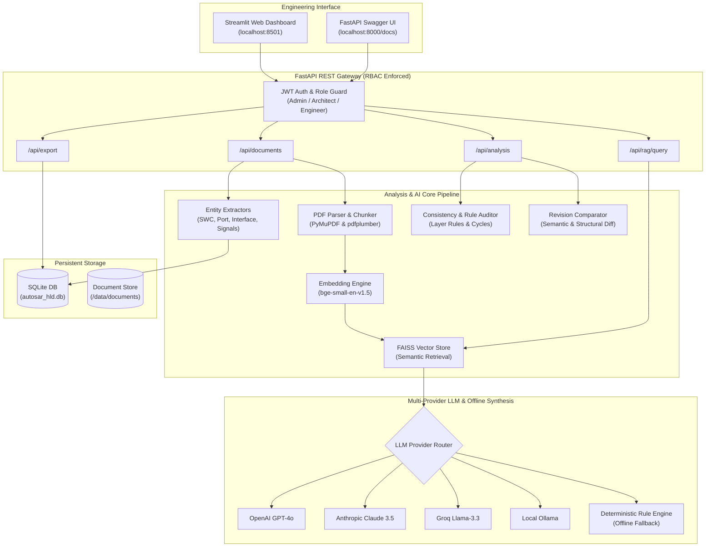

# ⚡ AUTOSAR HLD AI — Document Analysis & Architecture Assistant

<p align="center">
  
  
  
  
  
  
  
</p>

An enterprise-grade, evidence-grounded AI architecture assistant for **AUTOSAR High-Level Design (HLD)** specifications. Performs automated document ingestion, architectural entity extraction, multi-provider semantic RAG Q&A with grounded citations, deterministic offline rule synthesis, revision diffing, compliance validation, and AUTOSAR 4.x **ARXML** model export.

---

## 📑 Table of Contents

- [Key Functional Capabilities](#-key-functional-capabilities)
- [System Architecture](#-system-architecture)
- [Supported LLM Providers & Offline Engine](#-supported-llm-providers--offline-engine)
- [Project Directory Structure](#-project-directory-structure)
- [Quick Start Guide](#-quick-start-guide)
- [REST API Reference & Endpoints](#-rest-api-reference--endpoints)
- [Environment Configuration](#-environment-configuration)
- [Automated Testing & CI/CD](#-automated-testing--cicd)
- [Automotive Standards & ISO 26262 Notice](#-automotive-standards--iso-26262-notice)

---

## 🚀 Key Functional Capabilities

```
                  ┌────────────────────────────────────────────────────────┐
                  │        AUTOSAR HLD AI Assistant Core Capabilities      │
                  └──────────────────────────┬─────────────────────────────┘
                                             │
      ┌──────────────────┬───────────────────┼───────────────────┬──────────────────┐
      ▼                  ▼                   ▼                   ▼                  ▼
  [1. Ingest Hub]  [2. Entity Extractor] [3. Grounded RAG] [4. Diff Engine]  [5. Compliance & ARXML]
  • Multi-page PDF • SWC Classification  • OpenAI / Claude • Baseline vs     • Missing Providers
  • Table parsing  • Ports (P/RPort)     • Groq Llama-3    • Breaking Delta  • Layer Violations
  • BGE Embeddings • Interface Types     • Offline Rules   • Deleted SWCs    • Cyclic Dependencies
  • FAISS Index    • Signal Mapping      • Exact Citations • Port Signature  • ARXML & MD Reports
```

### 1. 📄 Multi-Modal Document Ingestion & Chunking
- Ingests complex multi-page AUTOSAR HLD PDFs using `PyMuPDF` (`fitz`) and `pdfplumber`.
- Extracts structured tables (interface definitions, timing schedules, pin mappings) and metadata.
- Context-aware hierarchical chunking preserves AUTOSAR section boundaries and sub-clause hierarchy.
- Computes dense vector embeddings using `BAAI/bge-small-en-v1.5` with persistent `FAISS` indexing.

### 2. 🧩 Architecture Entity Extraction & Catalog
- **Software Components (SWCs)**: Automated classification into `ApplicationSWC`, `SensorActuatorSWC`, `ServiceSWC`, `ComplexDriverSWC`, and `ECUAbstractionSWC`.
- **Port Interfaces**: Extraction of `SenderReceiver`, `ClientServer`, and `Parameter` interfaces.
- **Ports & Signals**: Directional extraction of Provided (`PPort`) and Required (`RPort`) ports with mapped interfaces and data signals.

### 3. 💬 Evidence-Grounded Architecture RAG Q&A
- Multi-turn question answering over complex SWC behaviors, contactor states, cell monitoring loops, and thermal regulation algorithms.
- **Verified Source Citations**: Returns exact document names, page numbers, section headers, relevance confidence scores, and verbatim text snippets.
- **Groundedness Verification**: Automatic hallucination detection comparing generated statements against retrieved context.

### 4. 🔄 Revision Comparison & Breaking Change Diff Engine
- Compares baseline revisions (e.g., `HLD v1.0`) against target revisions (e.g., `HLD v2.0`).
- Flags **breaking architectural changes**:
  - Deleted or renamed Software Components.
  - Port interface signature modifications (e.g., data type changed, baud rate modified).
  - Dangling connectors and newly unconsumed ports.
- Calculates component, interface, and port delta percentages.

### 5. ⚠️ Architecture Compliance & Inconsistency Auditor
- **Unconnected / Unconsumed Ports**: Identifies `RequiredPort` without matching `ProvidedPort` or vice versa.
- **AUTOSAR Layer Boundary Violations**: Flags Application Layer SWCs illegally bypassing the Runtime Environment (RTE) to directly call MCAL drivers.
- **Cyclic Dependency Detection**: Detects circular execution dependencies that violate RTE initialization and task scheduling order.
- **Architecture Health Score**: Computes an automated score (0–100) based on critical, warning, and informational findings.

### 6. 📊 Bidirectional Traceability Matrix
- Extracts functional and safety requirements (`REQ_...`, ASIL statements, shall/must clauses).
- Maps requirements to implementing Software Components, Ports, and Interfaces.
- Computes requirement verification coverage.

### 7. 📑 Formal Reports & AUTOSAR ARXML Export
- Generates AUTOSAR 4.x compliant **`ARXML`** XML skeletons ready for import into Vector DaVinci Developer, ETAS ISOLAR, or EB tresos.
- Exports comprehensive Markdown and HTML Architecture Summary and Audit Reports.

---

## 🏛️ System Architecture



---

## 🤖 Supported LLM Providers & Offline Engine

The assistant supports flexible deployment across air-gapped automotive environments and cloud platforms:

| Provider | Model Name | Description | Key Requirement |
|:---|:---|:---|:---|
| **Anthropic Claude** | `claude-3-5-sonnet-20241022` | Advanced engineering reasoning & code synthesis | `ANTHROPIC_API_KEY` |
| **OpenAI** | `gpt-4o` / `gpt-4o-mini` | High-accuracy architecture analysis | `OPENAI_API_KEY` |
| **Groq** | `llama-3.3-70b-versatile` | Ultra-low latency inference (>300 tokens/s) | `GROQ_API_KEY` |
| **Local Ollama** | `mistral` / `llama3` | 100% on-premise, privacy-preserving local LLM | Local Ollama daemon |
| **Deterministic Rule Engine** | *Built-In AST Extractor* | **Offline mode** — synthesizes tables & rules without any API key | **None (Zero dependency)** |

---

## 📁 Project Directory Structure

```
autosar_hld_ai/
├── .github/
│   └── workflows/
│       └── ci.yml                 # Automated CI/CD GitHub Actions pipeline
├── app/
│   ├── analysis/
│   │   ├── inconsistency_checker.py # Layer violations, cyclic deps, unconnected ports
│   │   ├── revision_comparator.py   # Baseline vs Target HLD diff engine
│   │   └── traceability_matrix.py   # REQ_... to SWC/Port traceability
│   ├── backend/
│   │   ├── database.py              # SQLAlchemy engine & session factory
│   │   ├── main.py                  # FastAPI REST API with RBAC & 15+ endpoints
│   │   ├── models.py                # Database models (User, SWC, Port, Interface, etc.)
│   │   └── schemas.py               # Pydantic validation schemas
│   ├── embeddings/
│   │   └── embedding_service.py     # SentenceTransformers BGE embedding wrapper
│   ├── extraction/
│   │   ├── component_extractor.py   # SWC classification & entity extraction
│   │   ├── interface_extractor.py   # SenderReceiver / ClientServer interfaces
│   │   └── port_extractor.py        # PPort / RPort & directionality
│   ├── frontend/
│   │   └── streamlit_app.py         # Modern dark automotive Streamlit dashboard
│   ├── ingestion/
│   │   ├── chunker.py               # Context-aware section & heading chunker
│   │   ├── ocr.py                   # Tesseract OCR fallback for scanned diagrams
│   │   ├── pdf_parser.py            # PyMuPDF & pdfplumber extraction engine
│   │   └── table_extractor.py       # Table extraction and structure parsing
│   ├── rag/
│   │   ├── citation.py              # Citation generation & groundedness verification
│   │   ├── llm_service.py           # Multi-provider client (Claude, OpenAI, Groq, Ollama)
│   │   ├── prompt_builder.py        # System prompt & context assembler
│   │   ├── rag_pipeline.py          # End-to-end RAG workflow
│   │   ├── retriever.py             # Semantic vector retrieval from FAISS
│   │   └── rule_synthesizer.py      # Deterministic rule synthesis offline engine
│   ├── reports/
│   │   ├── export_service.py        # AUTOSAR 4.x ARXML & Mermaid flowchart generator
│   │   └── report_generator.py      # Formal Markdown / HTML architecture reports
│   └── utils/
│       ├── config.py                # Pydantic Settings & environment manager
│       ├── helpers.py               # Text formatting and calculation helpers
│       ├── logger.py                # Structured logging
│       └── security.py              # PBKDF2 hashing, JWT tokens, RBAC dependencies
├── data/
│   ├── generate_sample_hld_pdfs.py  # Script generating sample BMS HLD v1.0 & v2.0
│   └── seed_data.py                 # Seeds database and builds vector index
├── tests/
│   └── test_analysis_and_extraction.py # Comprehensive unit & integration tests
├── .env.example                     # Environment template
├── .gitignore                       # Git ignore file
├── README.md                        # Documentation
├── requirements.txt                 # Project dependencies
└── run.py                           # Unified application launcher
```

---

## ⚡ Quick Start Guide

### 1. Clone & Navigate
```bash
git clone https://github.com/rishil5786/autosar-hld-ai-assistant.git
cd autosar-hld-ai-assistant
```

### 2. Set Up Virtual Environment & Dependencies
```bash
python -m venv venv

# Windows (PowerShell)
.\venv\Scripts\Activate.ps1

# Linux / macOS
source venv/bin/activate

pip install -r requirements.txt
```

### 3. Generate Sample Documents & Seed Knowledge Base
```bash
python data/generate_sample_hld_pdfs.py
python data/seed_data.py
```

### 4. Launch the Application

#### 🖥️ Option A: Streamlit Engineering Dashboard
```bash
python run.py --mode frontend --port 8501
```
👉 Open **[http://localhost:8501](http://localhost:8501)** in your browser.

#### 🔌 Option B: FastAPI Backend REST API
```bash
python run.py --mode backend --port 8000
```
👉 Open **[http://localhost:8000/docs](http://localhost:8000/docs)** for interactive Swagger UI documentation.

---

## 📡 REST API Reference & Endpoints

| Method | Endpoint | Access / Role | Description |
|:---|:---|:---|:---|
| `POST` | `/api/auth/register` | Public | Register new user account |
| `POST` | `/api/auth/login` | Public | Authenticate and obtain JWT Bearer token |
| `POST` | `/api/auth/token` | Public | OAuth2 compliant password form token endpoint |
| `GET` | `/api/auth/me` | Authenticated | Get current user profile and role |
| `POST` | `/api/documents/upload` | Engineer / Architect | Upload new AUTOSAR HLD PDF |
| `POST` | `/api/ingestion/process/{doc_id}` | Engineer / Architect | Ingest, chunk, embed, and extract entities |
| `GET` | `/api/documents` | Public / Authenticated | List all registered documents |
| `GET` | `/api/documents/{doc_id}` | Public / Authenticated | Get document details and entity counts |
| `POST` | `/api/rag/query` | Public / Authenticated | Evidence-grounded RAG architecture Q&A |
| `GET` | `/api/extraction/{doc_id}` | Public / Authenticated | Get extracted SWCs, Ports, Interfaces |
| `GET` | `/api/analysis/inconsistencies/{doc_id}` | Public / Authenticated | Run AUTOSAR compliance audit |
| `GET` | `/api/analysis/traceability/{doc_id}` | Public / Authenticated | Get requirement traceability matrix |
| `POST` | `/api/analysis/compare` | Public / Authenticated | Compare two document revisions (Diff) |
| `GET` | `/api/export/arxml/{doc_id}` | Public / Authenticated | Download AUTOSAR 4.x compliant ARXML |
| `GET` | `/api/export/mermaid/{doc_id}` | Public / Authenticated | Export Mermaid.js component flowchart |
| `GET` | `/api/reports/architecture/{doc_id}` | Public / Authenticated | Download formal Markdown summary report |

---

## ⚙️ Environment Configuration

Configure your environment variables in `.env`:

```ini
# --- LLM Provider Selection ---
# Options: "openai", "anthropic", "groq", "ollama", "none" (deterministic offline rule engine)
LLM_PROVIDER=none

# OpenAI
OPENAI_API_KEY=sk-proj-xxxx
OPENAI_MODEL=gpt-4o-mini

# Anthropic Claude
ANTHROPIC_API_KEY=sk-ant-xxxx
ANTHROPIC_MODEL=claude-3-5-sonnet-20241022

# Groq (Ultra-Fast Inference)
GROQ_API_KEY=gsk_xxxx
GROQ_MODEL=llama-3.3-70b-versatile

# Ollama Local Daemon
OLLAMA_BASE_URL=http://localhost:11434
OLLAMA_MODEL=mistral

# Embedding & Database
EMBEDDING_MODEL=BAAI/bge-small-en-v1.5
DATABASE_URL=sqlite:///data/autosar_hld.db
VECTOR_STORE_PATH=data/vector_store
```

---

## 🧪 Automated Testing & CI/CD

The project includes unit, integration, and compliance validation tests:

```bash
python -m pytest tests/test_analysis_and_extraction.py -v
```

Automated GitHub Actions workflow (`.github/workflows/ci.yml`) runs on every push and PR across Python `3.10`, `3.11`, and `3.12`.

---

## 🔒 Automotive Standards & ISO 26262 Notice

AI-extracted architecture entities, dependency maps, and compliance audit reports are designed to assist automotive systems engineers and architects in accordance with **ASPICE (Automotive Software Process Improvement and Capability Determination)** Level 2/3 engineering practices and **ISO 26262 ASIL A-D** traceability workflows. All generated architectural artifacts must be formally reviewed and approved by an authorized AUTOSAR Architect before ECU software flashing or safety release.

---

<p align="center">
  Developed for Automotive Systems & Software Architects ⚡
</p>
